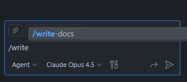

# Act 2: Standards Exist, but They're Not Enforced

> **Workshop Goal:** Learn how to embed AI agents into developer workflows to automatically enforce standards and handle the tasks humans consistently skip.

---

## The Scene: The Documentation Graveyard

Your team has standards. They're written down somewhere—maybe in a wiki, a README, or that Confluence page from 2023. The problem isn't that standards don't exist.

**The problem is that no one follows them consistently.**

Why? Because humans are humans:
- You love solving problems and writing code
- You don't love writing documentation, updating changelogs, or filling out PR templates
- Deadlines create shortcuts, and shortcuts become habits

**No blame. No shame. You're only human.**

---

## The Insight: Let the Non-Human Do the Non-Human Work

What if the things you consistently skip... just happened automatically?

| Human Tendency | Agent Solution |
|----------------|----------------|
| "I'll document this later" (you won't) | Agent generates docs on every commit |
| "The PR description is good enough" | Agent enforces PR templates and adds context |
| "I know what this code does" (for now) | Agent adds inline comments and README updates |
| "Security review can wait" | Agent runs compliance checks before merge |

**The pattern:** Encode your standards into agents, then embed those agents into workflows where they execute automatically.

---

## The Progression: Crawl → Walk → Run

We'll build up from manual prompts to fully automated pipelines.

---

## Phase 1: Crawl — Reusable Team Prompts

### The Concept

Start by creating reusable prompts that any team member can invoke on-demand. This is the lowest friction entry point—no infrastructure changes, no CI/CD modifications.

In GitHub Copilot, you can create **Slash Commands** by following the folder/naming convention:

```
<repo-root>/.github/prompts/<prompt-name>.prompt.md
```

### Example: Documentation Generator Prompt

Create a prompt at `.github/prompts/write-docs.prompt.md`:

```markdown
You are a technical documentation specialist. When invoked:

1. Analyze the current file or selection
2. Generate appropriate documentation based on the content type:
   - For functions/methods: JSDoc/docstrings with params, returns, and examples
   - For classes: Class-level documentation with usage examples
   - For modules: README sections with purpose, installation, and API reference
3. Follow our team's documentation standards:
   - Use present tense ("Returns" not "Will return")
   - Include at least one usage example
   - Document edge cases and error conditions
4. Output the documentation in a format ready to paste or commit
```

### Using the Prompt

Team members invoke it locally in VS Code:



---

### Real-World Examples: AKS Operational Prompts

This repo includes three production-ready prompts for Azure Kubernetes Service (AKS) operations. These demonstrate how platform teams can encode operational runbooks into reusable agent prompts.

#### Why Agents Instead of CLI Commands?

You might ask: *"I already know kubectl. Why do I need an agent prompt for this?"*

Here's how this ties back to our Act 2 problem statement:

| The Human Reality | The Agent Solution |
|-------------------|-------------------|
| At 3am during an incident, you (or a team member) forget which `kubectl` flags to use | Agent runs the complete diagnostic workflow every time |
| Senior engineer knows to check node pressure after pod failures—junior doesn't | Agent encodes the full troubleshooting sequence for everyone |
| Under pressure, you skip steps or jump to conclusions | Agent follows the same systematic process regardless of stress |
| Runbook in Confluence says "check pods" but not *how* | Prompt IS the executable runbook—no interpretation needed |
| New team member takes months to learn incident response | New hire invokes the prompt on day one |

**The core insight:** The kubectl commands aren't the hard part. The hard part is:
- Knowing which commands to run, in what order
- Interpreting the output correctly
- Connecting symptoms to root causes
- Remembering all of this at 3am when paged

These prompts encode your senior engineers' diagnostic intuition into something any team member can invoke—consistently, completely, every time.

---

#### 1. Check Pod Health ([aks-check-pods.prompt.md](../.github/prompts/aks-check-pods.prompt.md))

Diagnose unhealthy pods across your AKS cluster:

```markdown
# Check for Pod Health Issues

Check the health status of all pods in an Azure Kubernetes Service (AKS) 
cluster and identify any pods that are not in a 'Running' state. 
Provide a summary of the issues found and suggest possible remediation steps.

### Run these Commands
- kubectl get pods -n <namespace>
- kubectl describe pod <pod-name> -n <namespace>
- kubectl logs <pod-name> -n <namespace>

### Output
A report including: Cluster Name, Pod Name, Pod Status, Issues Found, 
and Suggested Remediation Steps.

### Remediation Suggestions
- Check for resource constraints (CPU, memory)
- Review pod logs for errors
- Scale the cluster if resource limits are being hit
- Redeploy the pod if it is in a crash loop

### Note
Do not generate any scripts. Only provide analysis and suggestions.
```

**Use case:** On-call engineer needs to quickly triage pod issues without memorizing all the kubectl commands and diagnostic steps.

---

#### 2. Check Node Health ([aks-check-nodes.prompt.md](../.github/prompts/aks-check-nodes.prompt.md))

Identify and diagnose unhealthy nodes in your cluster:

```markdown
# Check for AKS Nodes Health Issues

Check the health status of all nodes in an Azure Kubernetes Service (AKS) 
cluster and identify any nodes that are not in a 'Ready' state.

### Run these Commands
- kubectl get nodes
- kubectl describe node <node-name>
- kubectl top nodes
- kubectl cluster-info

### Output
A report including: Cluster Name, Node Name, Node Status, Issues Found, 
and Suggested Remediation Steps.

### Remediation Suggestions
- Check for resource constraints (CPU, memory)
- Review node logs for errors
- Scale the cluster if resource limits are being hit
- Contact Azure support if the issue persists
```

**Use case:** Platform engineer investigating cluster-level issues, capacity problems, or node failures.

---

#### 3. Remediation Assistant ([aks-remediation.prompt.md](../.github/prompts/aks-remediation.prompt.md))

After diagnosis, get specific remediation guidance:

```markdown
# AKS Remediation for cluster issues

Provide remediation based on analysis and suggestions from the previous steps.

### Proposed Remediation Steps
Be specific in your remediation suggestions, including commands to run, 
configuration changes to make, or resources to consult. 
Tailor the suggestions based on the identified issues.

### Notes
- Do not generate any scripts.
- Always ask for confirmation before applying any remediation steps.
```

**Use case:** After running diagnostics, the engineer invokes this prompt to get specific, actionable remediation steps—without the agent making changes autonomously.

---

#### The Pattern: Diagnostic → Analysis → Remediation

These three prompts demonstrate a **chained workflow**:

```
┌─────────────────┐     ┌─────────────────┐     ┌─────────────────┐
│  aks-check-pods │ ──▶ │  aks-check-nodes│ ──▶ │ aks-remediation │
│  (What's wrong?)│     │  (System-level?)│     │  (How to fix?)  │
└─────────────────┘     └─────────────────┘     └─────────────────┘
```

Each prompt is:
- **Focused** — one responsibility per prompt
- **Safe** — analysis only, no autonomous changes
- **Actionable** — provides specific next steps
- **Reusable** — any team member can invoke without deep Kubernetes expertise

#### Connecting Back to Act 2's Theme

Remember: **"Standards exist, but they're not enforced."**

Your team probably *has* incident response standards:
- "Always check pod status before escalating"
- "Look at node health if multiple pods are failing"
- "Document what you tried before handing off"

But under pressure, these standards get skipped. The agent ensures the standard diagnostic process runs every time—not because humans are bad, but because **humans are human**.

This is the same pattern as auto-generating documentation: encode the standard into an agent, then let the agent enforce it consistently.

---

### Workshop Activity: Create Your First Team Prompt

**Time:** 15 minutes

1. Identify one task your team does inconsistently (docs, tests, PR descriptions, etc.)
2. Write a prompt that handles that task
3. Save it to `.github/prompts/`
4. Have a teammate test it on their code

**Discussion:** What standards surfaced while writing this prompt that weren't explicitly documented?

---

## Phase 2: Walk/Run — Automated Enforcement via CI/CD

### The Concept

Manual prompts are great, but they still require humans to remember to run them. The next level: **automate execution in your CI/CD pipeline**.

Every push, every PR—the agent runs whether you remembered or not.

### GitHub Actions + GitHub Copilot CLI

We'll use GitHub Actions to trigger our prompts automatically. See the complete example at [.github/workflows/copilot.generate-docs.yml](../.github/workflows/copilot.generate-docs.yml).

### How It Works

```yaml
name: Auto-Generate Documentation

on:
  push:
    branches: [main]
  workflow_dispatch:  # Manual trigger option

jobs:
  generate-docs:
    runs-on: ubuntu-latest
    steps:
      - uses: actions/checkout@v4
      
      - name: Install GitHub Copilot CLI
        run: npm install -g @github/copilot
        
      - name: Generate Documentation
        env:
          GITHUB_TOKEN: ${{ secrets.COPILOT_PAT }}
        run: |
          # Load prompt content
          PROMPT=$(cat .github/prompts/write-docs.prompt.md)
          
          # Execute against changed files
          copilot -p "$PROMPT"
```

### Key Components

| Component | Purpose |
|-----------|---------|
| **Trigger: `push` to main** | Ensures docs are generated on every merge, regardless of whether the developer ran the prompt locally |
| **Trigger: `workflow_dispatch`** | Allows manual execution for catch-up or testing |
| **GitHub Copilot CLI** | Enables scripted/automated execution of Copilot outside of the IDE |
| **Prompt as environment variable** | Loads your team's custom prompt for consistent execution |

### Authentication Note

> [!NOTE]
> **GitHub Copilot CLI Authentication**
> 
> Currently, GitHub Copilot is licensed per-user, meaning API calls must be authenticated with a user account. For CI/CD automation:
> 
> 1. Create a **Fine-Grained Personal Access Token (PAT)** with `Copilot-Requests: Read-only` permission
> 2. Store it as a repository secret (e.g., `COPILOT_PAT`)
> 3. This consumes **Premium Request Units (PRUs)** from the token owner's account
> 
> Future: GitHub is investigating organization-level Copilot API access for CI/CD scenarios (e.g. GitHub Actions and GitHub Apps).

---

## Advanced Patterns

### Pattern: Security Compliance Check

Run security-focused prompts on infrastructure or sensitive code changes:

```yaml
on:
  pull_request:
    paths:
      - 'infrastructure/**'
      - '**/security/**'
      - '**/*.tf'

jobs:
  security-review:
    steps:
      - name: Security Compliance Review
        run: |
          export PROMPT=$(cat .github/prompts/security-baseline.prompt.md)
          copilot -p "$PROMPT"
```

---

## Workshop Activity: Build Your Automation Pipeline

**Time:** 30 minutes

1. **Choose a standard** your team has but doesn't consistently enforce
2. **Write the prompt** that checks or generates compliance with that standard
3. **Create a GitHub Action** that runs this prompt on appropriate triggers
4. **Test it** by pushing a commit that would normally skip this standard

**Checkpoint Questions:**
- What triggers make sense for this automation? (push, PR, schedule, manual)
- Should failures block the pipeline or just warn?
- How will you handle false positives?

---

## Key Takeaways

- **Crawl:** Start with reusable prompts team members run manually—low friction, immediate value
- **Walk:** Add CI/CD triggers so prompts run automatically on key events
- **Run:** Build comprehensive pipelines that enforce multiple standards consistently
- **The meta-benefit:** Writing prompts forces you to articulate standards that were previously implicit

---

## Common Pitfalls

| Pitfall | Solution |
|---------|----------|
| **Over-automation too fast** | Start with advisory (non-blocking) automation, then tighten |
| **Prompts that are too generic** | Include your team's specific standards and examples |
| **Ignoring false positives** | Build in human override mechanisms and feedback loops |
| **Token/PRU budget surprises** | Monitor usage and set alerts on consumption |

---

## Reference Resources

**GitHub Copilot CLI:**
- [Official Documentation](https://docs.github.com/en/copilot/github-copilot-in-the-cli)
- [Events That Trigger Workflows](https://docs.github.com/en/actions/reference/workflows-and-actions/events-that-trigger-workflows)

**Example Prompts in This Repo:**
- [aks-check-pods.prompt.md](../.github/prompts/aks-check-pods.prompt.md) — Diagnose unhealthy pods
- [aks-check-nodes.prompt.md](../.github/prompts/aks-check-nodes.prompt.md) — Diagnose unhealthy nodes
- [aks-remediation.prompt.md](../.github/prompts/aks-remediation.prompt.md) — Get remediation guidance
- [analyze-for-docs.prompt.md](../.github/prompts/analyze-for-docs.prompt.md) — Generate documentation

**Example Workflows:**
- [Documentation Generator Workflow](../.github/workflows/copilot.generate-docs.yml)

---

## Next Up

In **[Act 3](../Act-3/README.md)**, we'll explore how agents can help with operational challenges—debugging live systems, incident response, and maintaining production infrastructure.
